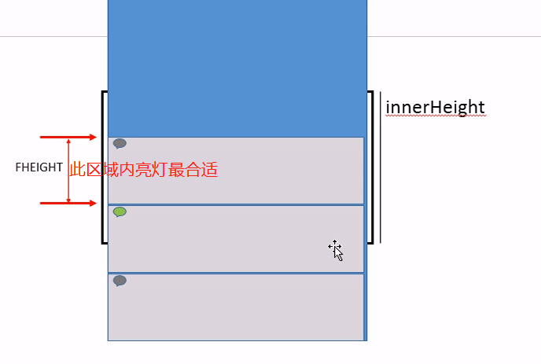
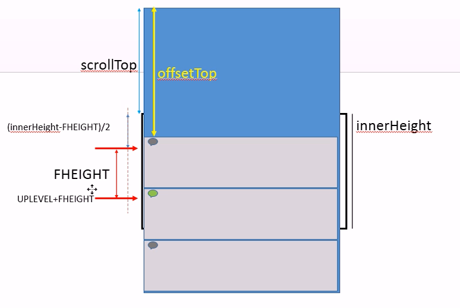
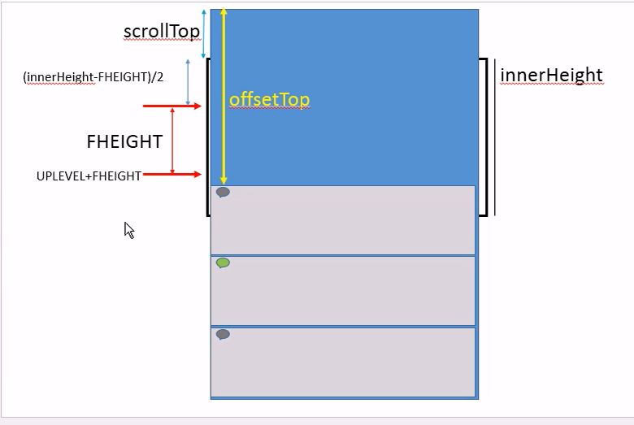
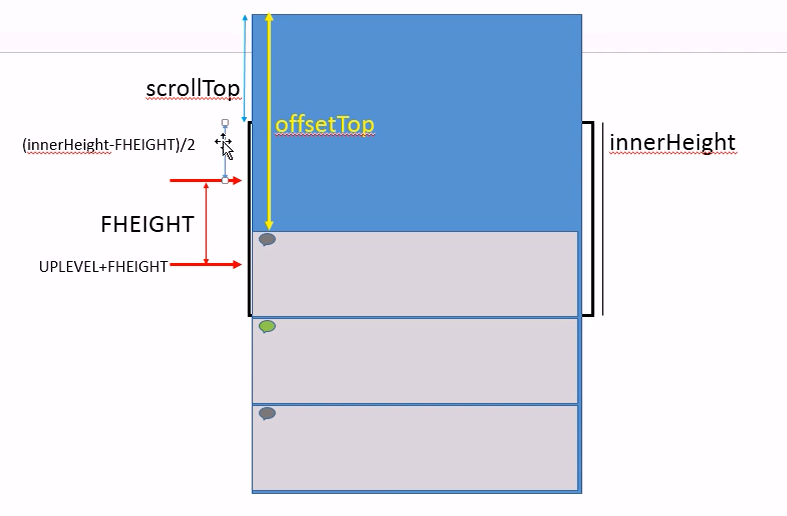

# 京东首页

### 项目目标

熟练使用并掌握html css，能够用html+css 100%还原网页
熟悉jQuery的使用，并能够使用jQuery做一些页面交互效果 ( 如: 广告轮播图 ) 

### 项目技术

- html
- css
- jQuery

### 此文主要是记录页面的交互效果

---

### 一. 使用（面向对象的方式）jQuery动态制作广告轮播图

- 核心: animate()和delay()

- 简要原理：(假设有5张图片：0，1，2，3，4)

  - 一开始就复制第一张图片到末尾

    - 此时页面上就有6张图片：0，1，2，3，4，5
    - 其中5和0是同一张图片

  - 播放到最后一张图片 ( 5 ) 之后
    - 马上将 `left` 置为0    ( 程序执行飞快，此过程用户肉眼不可见 )

- 准备工作

  - html页面

  ```html
  <div id="slider">
    <ul id="imgs"></ul>
    <ul id="indexs"></ul>
  </div>
  ```

  - 轮播图所需数据

    ```js
    /*广告图片数组*/
    var imgs=[
      {"i": 0, "img": "Images/index/banner_01.jpg"},
      {"i": 1, "img": "Images/index/banner_02.jpg"},
      {"i": 2, "img": "Images/index/banner_03.jpg"},
      {"i": 3, "img": "Images/index/banner_04.jpg"},
      {"i": 4, "img": "Images/index/banner_05.jpg"},
    ];
    ```

- 项目开始

  - 声明slider对象, 并设置属性

    ```js
    var slider = {
      LIWIDTH: 670, // 保存轮播图li的宽度
      $ulImgs: null, //保存ul#imgs
      $ulIndexs: null, // 保存ul#indexs
      init() {},
      initView() {} // 初始化页面
    }
    slider.init();
    ```

    - 在init方法中找到ul#imgs和ul#indexs

    ```js
    // 找到ul#imgs
    this.$ulImgs = $("#imgs");
    // 找到ul#indexs
    this.$ulIndexs = $("#indexs");
    ```

  - initView 方法: 初始化页面

    ```js
    // 遍历imgs,生成htmlImgs和htmlIndexs
    for (var i = 0, htmlImgs = "", htmlIndexs = ""; i < imgs.length; i++) {
      // htmlImgs <li></li>
      htmlImgs += `<li></li>`;
      // htmlIndexs <li></li>
      htmlIndexs += `<li>${i + 1}</li>`;
    }// (遍历结束)

    // 设置ul#imgs内容为htmlImgs
    this.$ulImgs.html(htmlImgs);
    // 设置ul#imgs宽为imgs个数*LIWIDTH
    this.$ulImgs.css("width", (imgs.length + 1) * this.LIWIDTH);

    // 在$ulImgs末尾追加一个li(克隆第一个li, 追加到末尾)
    this.$ulImgs.append(this.$ulImgs.children(":first").clone());

    // 设置ul#indexs内容为htmlIndexs
    this.$ulIndexs.html(htmlIndexs);

    // 设置$ulIndexs中第一个li添加hover class
    this.$ulIndexs.children(":first").addClass("hover");
    ```

  > 在init方法中调用initView方法 `this.initView();` 


-    轮播

-    原理

     - 修改ul#imgs的left

-    实现:

     - DURATION: 单次移动的时间(动画时间)
     - WAIT: 轮播时间间隔(定时器执行时间间隔)
     - moved: 已经左移的li个数
       - ul移动之前moved先+1
       - `ul.left = moved * LIWIDTH;`
       - 如果moved === imgs.length => ul.left = 0  moved = 0;
     - 添加autoMove方法 // 自动轮播
     ```js
     autoMoved() { // 自动轮播
     this.moved++;
     // 先等待WAIT, 再移动到moved*LIWIDTH
     this.$ulImgs.delay(this.WAIT).animate({
     left: - this.moved * this.LIWIDTH
     }, this.DURATION, function () { // 本次移动后
     if (this.moved === imgs.length) { // 如果moved等于imgs.length
     this.$ulImgs.css("left", 0); // 将ul#imgs的left = 0
     this.moved = 0; // 将moved = 0
     }
     // 再次启动自动轮播
     this.autoMove();
     }.bind(this));
     }
     ```
     - 序号的实现
       - 在任意一次调用轮播之前,设置ul#indexs中moved位置的li的class为hover
       ```js
       changeHover() {
       // 将ul#indexs中moved位置的原点添加hover,去掉兄弟的hover
       this.$ulIndexs.children().eq(this.moved)
       .addClass("hover").siblings().removeClass("hover");
       }
       ```
       > 至此, 自动轮播就完成了

-    鼠标进入停止动画, 移出再次启动
     ```js
                                                                                                                $("#slider").hover(function () { // over
                                                                                                                  this.$ulImgs.stop(true);
                                                                                                                }, function () { // out
                                                                                                                  this.autoMove();
                                                                                                                });
     ```

#### 1. 优化鼠标进入移出效果

> 鼠标进入时, 如果遇到前后图片还未轮播完成的情况 , 会直接卡在那里

**解决: 鼠标进入时指向哪一张图片, 就将该图片作为当前轮播图片**

- 为$ulImgs添加鼠标进入事件监听, 只允许li > img 响应事件
  ```js
    // 为$ulImgs添加鼠标进入事件监听, 只允许li > img 响应事件
    this.$ulImgs.on("mouseover", "li>img", function (e) {
    var $img = $(e.target);
    // 获得当前img的下标
    var i = $img.index("#imgs img");
    // 修改moved = i
    this.moved = i;
    // 修改#ulImgs的left为-moved*LIWIDTH
    this.$ulImgs.css("left", -this.moved * this.LIWIDTH);
    // 根据moved修改hover
    this.changeHover();
    }.bind(this));
  ```

#### 2. 添加手动切换轮播图的效果

  > 鼠标移入序号切换图片
```js
    // 为$ulIndexs添加鼠标进入事件监听, 只允许li响应
    this.$ulIndexs.on("mouseover", "li", function (e) {
      var $li = $(e.target);
      if (!$li.is(".hover")) { // 如果当前li不是hover状态
        var endi = $li.index("#indexs > li"); // 获取鼠标移入的li
        var stari = $(".hover").index("#indexs > li"); // 获取hover状态的li
        // 修改moved为endi-stari
        this.moved += (endi - stari);
        this.changeHover(); // 立刻修改hover状态
        // 修改$ulImgs位置  先stop,防止动画叠加
        this.$ulImgs.stop(true).animate({
          left: -this.moved * this.LIWIDTH
        }, this.DURATION);
      }
    }.bind(this));
```

#### 3. 修复轮播图混乱问题

> 如果鼠标跨苏的移入移出轮播图时, 会导致轮播图混乱

- 原因:
  -  在项目中使用到了delay() 和animate(), 以及用来停止动画的stop()
  -  而stop()不能停止delay(), 只能停止animate()

- 解决
  - 使用一个无意义的动画 `animate({"null": 1}, this.WAIT)` 代替delay();
  - 然后在其回调函数中执行真正的动画

  ```js
  autoMove() { // 自动轮播
    this.moved++;
    // 先等待WAIT, 再移动到moved*LIWIDTH
    this.$ulImgs.animate({"null": 1}, this.WAIT, function () { // this->slider对象
      // 真正的动画
      this.$ulImgs.animate({
        left: - this.moved * this.LIWIDTH
      }, this.DURATION, function () { // 本次移动后
        if (this.moved === imgs.length) {// 如果moved等于imgs.length
          this.$ulImgs.css("left", 0); // 将ul#imgs的left = 0
          this.moved = 0; // 将moved = 0
        }
        this.changeHover();
        // 再次启动自动轮播
        this.autoMove();
      }.bind(this));

    }.bind(this));
  },
  ```

---

### 二. 楼层滚动

#### 几个概念

> scrollTop: 页面垂直方向上滚动的距离 ( 随页面滚动而改变 )
> offsetTop: 元素距离body顶端的距离 ( 固定不变的 )
> innerHeight: 窗口的高度 ( 固定不变的 ) 

#### 几个定义

> 1. 定义FHEIGHT  表示楼层的高度
> 2. 定义UPLEVEL 表示楼层灯亮区域的上限
> 3. 定义DOWNLEVEL 表示楼层灯亮区域的下限

#### 算法

- 选取亮灯区域

  

> 1. 设定UPLEAVEL为 `( innerHeight - FHEIGHT ) / 2`
> 2. 设定DOWNLEAVEL为 `UPLEVEL + FHEIGHT`

- 灭灯
  - 上限:  当楼层气泡 ( .floor>header>span ) 的 offsetTop < scrollTop + UPLEVEL
     
  - 下限:  当楼层气泡 ( .floor>header>span ) 的 offsetTop > scrollTop + ( UPLEVEL + FHEIGHT )
     

- 亮灯
  - 当楼层气泡 ( 第n F ) 的 offsetTop > scrollTop + UPLEVEL && < scrollTop + DOWNLEVEL
    

#### 实现

##### 定义elevator对象, 并设置属性

```js
var elevator = {
  FHEIGHT: 414, // 保存楼层高度
  UPLEVEL: 0, // 保存亮灯区域的上限
  DOWNLEVEL: 0, // 保存亮灯的下限
  init() {
    var that = this; // 保存elevator对象
    // 计算UPLEVEL和DOWNLEVEL
    that.UPLEVEL = (innerHeight - that.FHEIGHT) / 2;
    that.DOWMLEVEL = that.UPLEVEL + that.FHEIGHT;
    // 为当前窗口添加滚动事件,jQuery中只能为window添加scroll事件
    $(window).scroll(function () {
      ......
    })
  }
}
```

- 检查snap是否亮灯( 滚动距离 )

  - 添加属性 `$spans` , 并找到 span `that.$spans = $(".floor>header>span");` 

```js
checkSpan() { // 检查每个楼层的span是否亮灯
  var that = this; // 保存elevator对象
  // 为每个span执行相同操作
  that.$spans.each(function (i) { // this -> 当前span
    // 获得当前span的offsetTop
    var offsetTop = $(this).offset().top;
    // 获得页面滚动的scrollTop
    var scrollTop = $(document.documentElement).scrollTop();
    // offsetTop>(scrollTop+UPLEVEL)&&<=(scrollTop+DOWNLEVEL)
    if (offsetTop > (scrollTop + that.UPLEVEL) && offsetTop <= (scrollTop + that.DOWNLEVEL)) {
      // 设置当前span的class为hover
      $(this).addClass("hover");
    } else {// 否则
      // 清除当前span的class
      $(this).removeClass("hover");
    }
  });
}
```

- 在滚动事件处理函数中调用checkSpan方法 `that.checkSpan();`

##### 电梯按钮的实现

> 如果有气泡亮灭, 控制电梯按钮的显示与否
> 如果灯亮, 显示对应的楼层名字( 家电通讯 ) , 隐藏楼层号( 1F )

- 添加属性 `$elevator` 保存电梯按钮, 并找到 `that.$elevator = $("#elevator");`

- 显示与隐藏楼层

> 在滚动事件处理函数中判断是否显示隐藏

```js
// 如果气泡亮，显示按钮
if (that.$spans.is(".hover")) that.$elevator.show();
else that.$elevator.hide(); // 否则隐藏按钮
```

- 显示与隐藏楼层名字

> 在设置楼层号的hover时判断

```js
// 如果offsetTop>(scrollTop+UPLEVEL)&&<=(scrollTop+DOWNLEVEL)
if (offsetTop > (scrollTop + that.UPLEVEL)
  && offsetTop <= (scrollTop + that.DOWNLEVEL)) {
    // 设置当前span的class为hover
    $(this).addClass("hover");

    // 找到id为elevator下ul中i位置的li
    that.$elevator.find("ul > li").eq(i)
      // 显示第二个a，隐藏第一个a
      .children(":first").hide()
      .next().show();

} else { //否则
  // 清除当前span的class
  $(this).removeClass("hover");

  // 找到id为elevator下ul中i位置的li
  that.$elevator.find("ul > li").eq(i)
    // 隐藏第二个a，显示第一个a
    .children(":first").show()
    .next().hide();
}
```

- 鼠标进入电梯按钮时, 显示楼层名, 隐藏楼层号

> 为elevator下ul绑定鼠标进入事件
> 如果当前span是亮灯状态, 不更改其对应的电梯楼层状态

```js
that.$elevator.on("mouseover", "li", function () {
  $(this).children(":first").hide().next().show();
})
.on("mouseout", "li", function () {
  // 获得当前li的下标
  var i = $(this).index("#elevator>ul>li");
  // 如果当前li对应的span没亮灯
  if (!that.$spans.eq(i).is(".hover")) {
    $(this).children(":first").show().next().hide();
  }
});
```

- 点击电梯楼层, 页面滚动到对应楼层

> 当前气泡的offsetTop - UPLEVEL

```js
// 为elevator下ul绑定单击事件
that.$elevator.on("click", "li", function () {
  // 获得当前li的下标i
  var i = $(this).index("#elevator>ul>li");
  // 获得spans中i位置的span的offsetTop
  var offsetTop = that.$spans.eq(i).offset().top;
  // 计算滚动距离
  var scroll = offsetTop - that.UPLEVEL;
  // 滚动
  $(document.documentElement).stop(true).animate({
    scrollTop: scroll
  }, 500);
});
```
